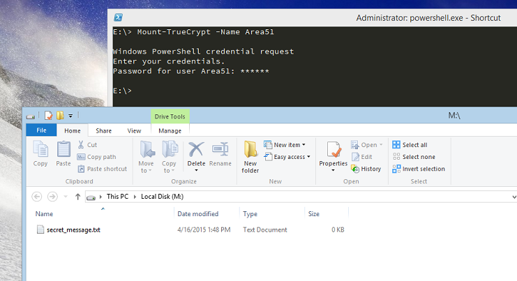

# PSTrueCrypt
PSTrueCrypt is a Powershell module to interact with TrueCrypt.  TrueCrypt passwords are handled via Windows Credential Manager.

Public functions are Mount-TrueCrypt and Dismount-TrueCrypt.

## Instructions
* Download project to your Powershell Module directory
* Rename PSTrueCrypt-Config.Sample.xml file to 'PSTrueCrypt-Config'.
* Add TrueCrypt password to Windows Credential Manager.  To add Windows Credentials, open up Control Panel>User Accounts>Credential Manager and click "Add a generic credential".  The "Internet or network address" field must equal the credential attribute in a the config node.
* Mount TrueCrypt container

### Roadmap
* Add project to PSGet Directory
* Add tab completion (via PSReadLine) for config settings
